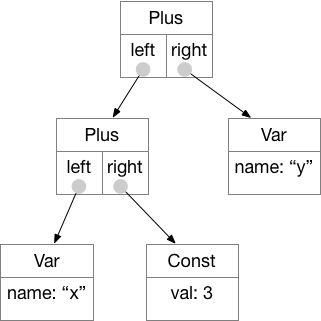
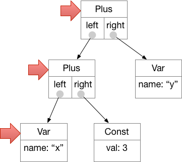
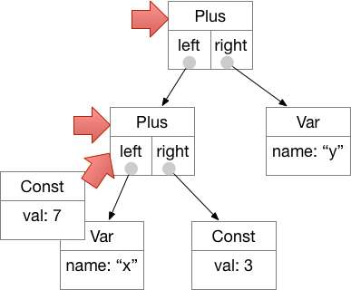
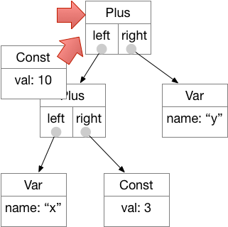
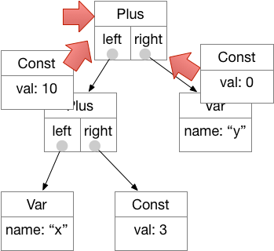
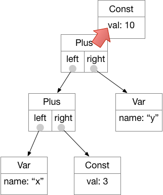

# Calculator

Usage:  ```python3 calc.py```

Example use: 

```
$ python3 calc.py 
expression/'help'/'quit': 7 3 +
((7 + 3)) -> 10
expression/'help'/'quit': 7 x =
(let x = 7) -> 7
expression/'help'/'quit': x 3 +
((x + 3)) -> 10
expression/'help'/'quit': x 3 5 + *
((x * (3 + 5))) -> 56
expression/'help'/'quit': x 3 + 5 * 
(((x + 3) * 5)) -> 50
expression/'help'/'quit': quit
```

There are many desk calculator applications, some with fancy graphical interfaces.  This one doesn't have a fancy graphical interface, but it does have variables with values stored in memory. 

Note that this calculator uses postfix notation, also known as reverse Polish notation (RPN).  Operands are written first, followed by an operation.  Parentheses are not required.  We can group operations as we wish just by putting operations in the right order.  Thus: 

```
$ python3 calc.py 
expression/'help'/'quit': 3 4 * 5 +
(((3 * 4) + 5)) -> 17
expression/'help'/'quit': 3 4 5 * +
((3 + (4 * 5))) -> 23
```

A variable can be given a value with =, like this: 

```
expression/'help'/'quit': 3 4 + x =
(let x = (3 + 4)) -> 7
```

Then the variable value can be used in subsequent input: 

```
expression/'help'/'quit': 3 x +
((3 + x)) -> 10
```

If a variable has not been given a value, it is treated as zero: 

```
expression/'help'/'quit': x y +
((x + y)) -> 7
```

## How it works

### The source files

The calculator code in calc.py is a *read evaluate print loop*, often abbreviated REPL.  The *read* part is in ```lexer.py``` (which breaks the input line into a stream of symbols) and ```rpn_parse.py``` (which determines the structure of the expression).  These have been provided.  The main work is in ```expr.py```, which defines the internal expression data structure including the methods to evaluate expressions.  File ```syntax.py``` has a table that associates syntactic symbols like ```*``` in the input with classes like ```Times``` in ```expr.py```.  ```calc_state.py``` provides a class for storing variable values.   

### The expression structure

The heart of the calculator is the ```Expr``` class in ```expr.py```.   We can think of the expression structure as a tree.  Nodes in the tree may be constants (like 7 or 7.0), variables (like *x*), or binary operations like addition, subtraction, multiplication, and division.  Constants and variables are *leaves* of the expression tree.  Binary operations are *interior nodes* with two children, their left and right operands.  



Computer scientists and software developers customarily draw the *root* of a tree at the top and the *leaves* at the bottom.  We are apparently not very good at botany.  


 Each node in the tree is represented by an object that has an *eval* method.  The *eval* method takes an *Env* object (memory) as an argument (because we need the contents of memory to know what *x + 7* should be).    Evaluation of interior nodes proceeds recursively:  Evaluate the operands, and then apply the operation.  


Let's consider the steps in evaluation 
of ```((x + 3) + y)```, supposing a value 7 has previously been stored with key *x* but no value has been stored with *y*.   In the input, the expression is written in RPN as ```x 3 + y +```.  
Internally it is represented as an expression 
object ```Plus(Plus(Var('x'),Const(3)),Var('y'))```


We begin at the root of the tree. Before we can evaluate that node, we must evaluate its left and right operands, and before we can evaluate its left operand, we must evaluate *its* left operand ... thus we work our way recursively down to the Var node at the leftmost leaf: 



We have bound variable *x* to the constant value 7 with the assignment ```let x = 7```, so the eval(env) method applied to Var("x") returns the value Const(7): 



The Const(3).eval(env) returns Const(3), so now the Plus node can be evaluated.  Seeing that both of its operands have evaluated to constants, it can add them and produce Const(10). 



The Plus node at the root still needs to evaluate its right operand.   *y* is unbound (we have not given it a value).  Our ```Env``` object provides a default value for uninitialized variables, so ```Var("y").eval(env)``` returns ```Const(0)```.



Now that the root node has the results of its operands, it returns its result: 

 
 
## What you must do

As you can see, most of the work of representing and evaluating expressions is in classes like *Plus*, *Times*, etc., in file *expr.py*.  They are called *binary operators* because they take two operands.  Further guidance can be found in the [project description](https://classes.cs.uoregon.edu/18S/cis211/projects/calculator.php). 

